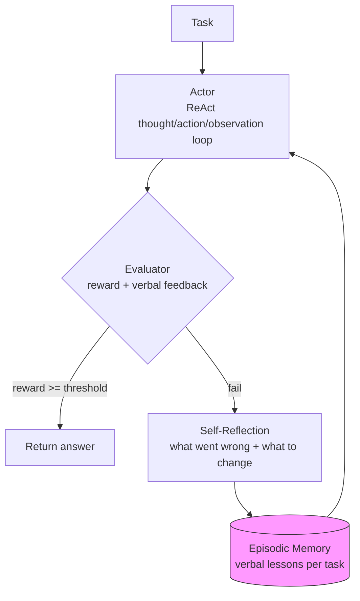

# Reflexion Agent

A clean, runnable implementation of **Reflexion: Language Agents with Verbal Reinforcement Learning** (Shinn et al., NeurIPS 2023, [arXiv:2303.11366](https://arxiv.org/abs/2303.11366)).

Instead of updating weights, a Reflexion agent improves by *talking to itself*: after each failed attempt it writes a verbal self-reflection ("I confused the novel with the film — next time disambiguate the entity"), stores it in episodic memory, and retries with those lessons in context.

## Architecture



## Project layout

```
reflexion-agent/
├── reflexion/
│   ├── agent.py     # ReflexionAgent: trial loop, ReAct actor, reflection step
│   ├── memory.py    # EpisodicMemory: per-task verbal lesson store (JSON-serializable)
│   ├── llm.py       # LLMBackend interface + MockBackend (offline demo)
│   │                #   + OpenAICompatibleBackend (real models via env config)
│   └── tasks.py     # ToyWikiQATask: mock Wikipedia + heuristic evaluator
├── examples/
│   └── run_demo.py  # End-to-end demo: fail -> reflect -> succeed
└── tests/
    └── test_reflexion.py
```

## Quickstart

```bash
git clone https://github.com/sulaimanvesal/reflexion-agent.git
cd reflexion-agent
pip install -r requirements.txt

# Run the demo (no API keys needed — uses the scripted MockBackend)
python examples/run_demo.py

# Run the tests
pytest -q
```

Expected demo output: trial 0 answers `1941` (the novelist's birth year — the ambiguity trap), reflects, then trial 1 answers `1970` correctly.

## Implementation details

Paper-to-code mapping:

| Paper concept | Implementation |
|---|---|
| Actor $M_a$ (ReAct policy) | `ReflexionAgent._run_trial` — thought/action/observation loop, max 6 steps |
| Evaluator (heuristic / LLM / self) | `ToyWikiQATask.evaluate` → `(reward, feedback)`; heuristic exact-match with explanatory feedback |
| Self-Reflection $M_{sr}$ | `LLMBackend.reflect(trajectory, feedback)` → 1–2 sentence verbal lesson |
| Episodic memory | `EpisodicMemory`: lessons keyed by task id, most-recent-first recall, `save`/`load` JSON |
| Trial loop | `ReflexionAgent.run`: up to `max_trials`, stops early on success |

Design choices worth knowing:

- **Backend interface is two methods** (`act`, `reflect`), so any chat model plugs in by subclassing `LLMBackend`. `OpenAICompatibleBackend` works with OpenAI or any OpenAI-style endpoint via `OPENAI_API_KEY` / `OPENAI_BASE_URL` / `REFLEXION_MODEL`.
- **The evaluator returns feedback, not just a score.** In the paper this verbal signal is what makes self-reflection useful; the toy task's feedback names the exact mistake ("you looked up the novel, not the 2006 film").
- **Memory is per-task and append-only within a run**, matching the paper's episodic memory; `recall(k=3)` keeps the prompt small.

## Extending it

1. Add a real benchmark task: implement the `Task` protocol (`id`, `question`, `tools`, `evaluate`, `success_threshold`) — e.g. a HotpotQA slice or an ALFWorld-style grid.
2. Swap the backend: `ReflexionAgent(backend=OpenAICompatibleBackend())`.
3. Persist lessons across runs with `memory.save("lessons.json")` / `EpisodicMemory.load(...)`.

## Reference

Shinn, N. et al. *Reflexion: Language Agents with Verbal Reinforcement Learning.* NeurIPS 2023. [arXiv:2303.11366](https://arxiv.org/abs/2303.11366)

## License

MIT — see [LICENSE](LICENSE).
